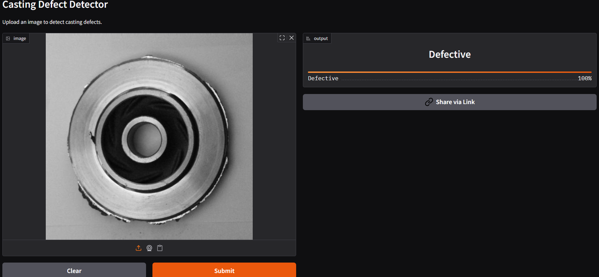

# 🏭 Casting Defect Detection using CNN  
A deep learning solution built to classify **defective** vs **non-defective** metal castings.  
This project uses a **Convolutional Neural Network (CNN)** and is deployed using **Gradio + Hugging Face Spaces** for real-time inference.

---

## 📌 Table of Contents
- Overview  
- Features  
- Dataset  
- Model Architecture  
- Training  
- Results  
- Demo  
- How to Use  
- Project Structure  
- Installation  
- Author  
- Connect With Me  

---

## 📘 Overview  
Metal casting defects can cause massive losses in manufacturing industries.  
This project automates defect detection using a trained CNN model that classifies images into:

- **Defective**  
- **OK (Non-defective)**  

The model is optimized, saved as **best_model.h5**, and served through a Gradio interface.

---

## ✨ Features
✔️ Real-time image classification  
✔️ Clean, simple Gradio UI  
✔️ Transfer-learning–ready architecture  
✔️ Works on CPU (no GPU required)  
✔️ Fully deployable on Hugging Face Spaces  

---

## 📂 Dataset  
**Casting Defect Dataset** containing:

| Class | Count |
|-------|--------|
| Defective | ~3,900 |
| OK (Non-defective) | ~3,900 |

Dataset Structure:
```
casting_data/
 ├── train/
 │    ├── defective/
 │    └── ok/
 └── test/
      ├── defective/
      └── ok/
```

---

## 🧠 Model Architecture  
The model is a CNN trained from scratch:

- Conv2D + ReLU  
- MaxPooling  
- Dropout  
- Fully Connected Layers  
- Output Softmax Layer  

Loss: **binary_crossentropy**  
Optimizer: **Adam**  
Metrics: **accuracy**

---

## 📊 Training
- Image Size: **224×224**  
- Epochs: **25–30**  
- Augmentation: Yes  
- Best model saved as: **best_model.h5**

---

## ✅ Results
| Metric | Score |
|--------|--------|
| Training Accuracy | ~98% |
| Validation Accuracy | ~97% |
| Test Accuracy | ~97% |

---

## 🚀 Demo  
You can try the live model here:

🔗 **Hugging Face Demo:** *[Add your link here](https://huggingface.co/spaces/RayanAIX/casting-defect-detector)*  

### 📷 Screenshot  


---

## 🛠 How to Use Locally

```bash
pip install -r requirements.txt
python app.py
```

---

## 📁 Project Structure

```
├── app.py                 # Gradio application
├── requirements.txt       # Dependencies
├── best_model.h5          # Saved model
├── dataset/               # Optional dataset folder
├── README.md
```

---

## ⚙️ Installation

```bash
git clone https://github.com/<your-username>/Casting-Defect-Detection-CNN.git
cd Casting-Defect-Detection-CNN
pip install -r requirements.txt
python app.py
```

---

## 👤 Author  
**Muhammad Rayan Shahid**

---

## 🔗 Connect With Me  

| Platform | Link |
|----------|-------|
| GitHub | https://github.com/Muhammad-Rayan |
| LinkedIn | https://linkedin.com/in/muhammad-rayan |
| Kaggle | https://kaggle.com/ |
| Hugging Face | https://huggingface.co/ |
| YouTube | https://youtube.com/@ByteBrillianceAI |

---

⭐ **If you like this project, give it a star!**  
